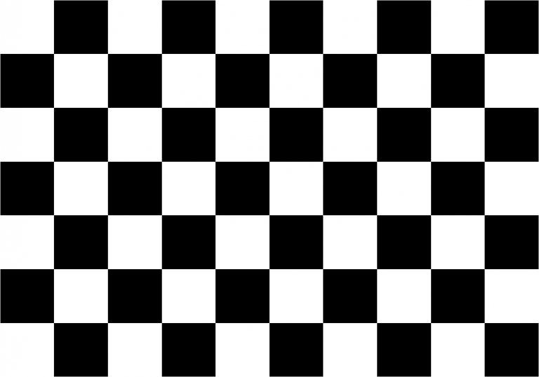

# Camera Calibration Using OpenCV

**This repository contains the code for [Camera Calibration Using Opencv](https://learnopencv.com/camera-calibration-using-opencv/) blog post**.

[](https://www.dropbox.com/sh/wp7kxnlptpg4o0l/AAC1Jp04cAuTitp3R6ustluMa?dl=1)

Calibrate your camera using OpenCV.

## Usage

[校正用画像](#追記校正用画像)を印刷し，校正したいカメラで撮影．
撮影したデータを`./img_camera/CHECKBOARD.jpg`等に保存し，次のいずれかのコマンドを実行すると，数値が色々出てくる．
これらをコピーし，`circleDetection.py` の該当箇所の数値と置き換える．

```shell
python3 cameraCalibration.py
python3 cameraCalibrationWithUndistortion.py
```

### 校正用画像

[](./チェッカーボード-768x538.png)
